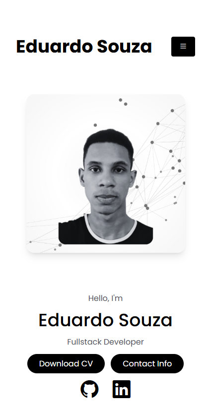
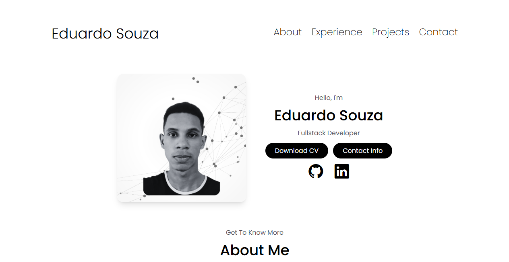

# 🌐 Portfólio Pessoal

Este é o meu portfólio pessoal desenvolvido com foco em **responsividade e performance**, utilizando **HTML, CSS, JavaScript** e **Tailwind CSS**. O design segue a abordagem **Mobile First**, garantindo ótima visualização em dispositivos móveis e depois adaptado para telas maiores (versão desktop).

## ✨ Funcionalidades

- Design responsivo com abordagem *mobile first*
- Animações suaves e layout moderno
- Estrutura clara para apresentar projetos, habilidades e informações de contato
- Desenvolvido com Tailwind CSS para facilitar o estilo e garantir consistência visual

## 🛠️ Tecnologias Utilizadas

- HTML5
- CSS3
- JavaScript
- [Tailwind CSS](https://tailwindcss.com)

## 📱 Layout

- **Mobile First**: o design foi iniciado para dispositivos móveis e posteriormente adaptado para telas maiores, como notebooks e desktops.

## 📸 Captura de Tela

### 📱 Mobile

### 🖥️ Desktop

## 🚀 Deploy

Você pode acessar o portfólio neste link: [https://seu-link.vercel.app](https://seu-link.vercel.app)

## 📄 Licença

Distribuído sob a Licença MIT. Veja `LICENSE` para mais informações.
